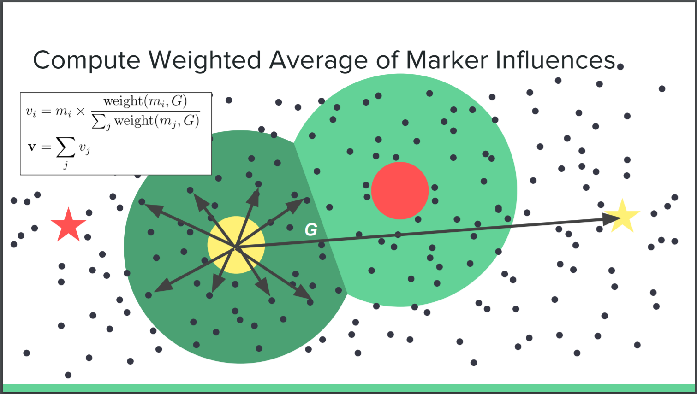

# BioCrowds

## Overview

BioCrowds is a space colonization algorithm for crowd simulation. This algorithm is based on the formation of veination patterns on leaves. It prevents agents from colliding with each other on their way to their goal points using a notion of "personal space". 

## Algorithm overview
### Setup and defined behaviours

- Markers (just points) are scattered throughout the simulation space, on the ground.
- Agents can travel only over pre-defined viable paths that are demarcated by being littered with markers.
- Agents move in the space by owning a collection of markers in a radius around them. The markers help determine a vector toward the goal while avoiding obstacles.
- At each simulation frame, each marker becomes "owned" by the agent closest to it (with some max distance representing an agent's perception).

### Summary of steps

1) Distribute markers in a uniform stratified manner.
2) Create a uniform grid acceleration structure and place markers in each cell of the grid. Ensure that the grid cell size is equal to the agent search distance (this makes it possible to only search 9 grid cells while looking for markers to influence the agent).
3) Place agents on the grid structure.
4) At every step of the simulation for every agent find the grid cell it is currently inside and search that cell and the surounding 8 grid cells for markers.
5) Accumulate a list of markers for each agent.
6) Use the agents to determine a direction vector towards the goal.
7) Update position and velocity for the agents.

### Computing Velocities

Agent velocity at the next frame is then computed using an averaged sum of the displacement vectors to each of its markers. Because a marker can only be owned by one agent at a time, this technique prevents agents from colliding (a cell will own all of the markers it is hovering over and so no other agent can be over those markers plus some buffer distance).

_pictures obtained from Austin Eng's brilliant ppt on the same topic, linked in the references section_

### Uniform Grid Acceleration

By placing markers in a uniform grid we can drastically reduce the number of markers the agent has to search through to find the markers that influence it. This spatial acceleration structure makes the demo run in real-time. This optimization also scales really well to larger and larger scenarios.

## References:
- https://cis700-procedural-graphics.github.io/files/biocrowds_3_21_17.pdf